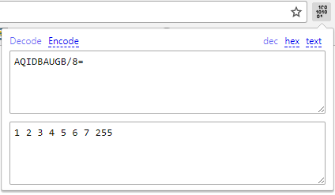
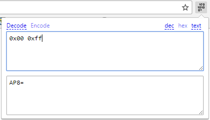
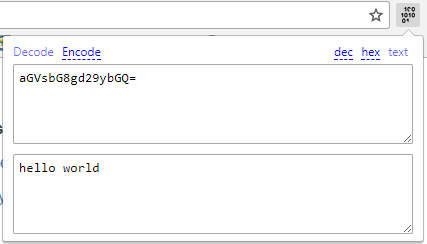

# Base64 to binary – and back again

A [chrome extension](https://chrome.google.com/webstore/detail/ajpoogneninennkhhnbmflmjjcagabpb/publish-accepted?hl=en-US) that can decode base64 string to and from array of bytes or ASCII string.
Suitable for working with binary data that cannot be represented as ASCII string.
Most similar extensions and online tools only try to work with ASCII and display some gibberish when non-printable characters are encountered.

Examples:

Icon made by [Freepik](http://www.freepik.com) from [www.flaticon.com](http://www.flaticon.com) is licensed by [CC 3.0 BY](http://creativecommons.org/licenses/by/3.0/).
